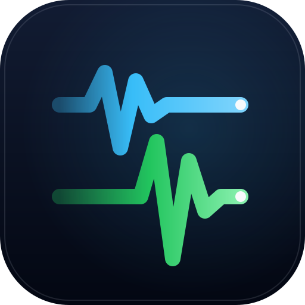

<p align="center"></p>

# 🌐 Quake MCS Listener

> **Lightweight, dependency-free bridge from earthquake push feeds to Home Assistant**  
> An experimental Android Earthquake Alerts (MCS) client, plus EMSC real-time reports that work today.

[](https://www.python.org/downloads/)
[](#)
[](https://www.home-assistant.io/)
[-8A2BE2.svg)](#)
[](LICENSE)

---

## 🧪 Project Status & Community Call

> [!WARNING]
> **The Google (AEAS) path is experimental and has not delivered an alert.**
> The TLS connection to `mtalk.google.com:5228`, the MCS login, the heartbeats and the protobuf decoder all work. However:
> - Google sends Android Earthquake Alerts through Play services to phones chosen by the location they report.
> - This anonymous, browser-type client is not one of those phones.
> - In our captures it receives heartbeats and nothing else.
>
> That is why the bridge also follows the **EMSC real-time feed**, which reliably pushes earthquakes worldwide a few minutes after they happen. Those are rapid reports, not early warnings.
>
> The full analysis, with captures, is in **[docs/HOW_IT_WORKS.md](docs/HOW_IT_WORKS.md)**. If you can show the Google path delivering (`--debug-frames` logs), please open an issue.

---

## ⚡ Highlights

- **Zero External Dependencies:** Built entirely with Python's standard library (`socket`, `ssl`, `struct`, `urllib`). No `pip install`, heavy runtimes, or Android emulators required.
- **Ultra-Lightweight:** Consumes less than **15 MB of RAM** and **0.0% CPU** at idle. Perfect for running 24/7 on a Raspberry Pi, home server, or Docker container.
- **Configurable Keepalive Pings:** Network-friendly ping intervals (`--ping-interval 120`, configurable between 30s and 600s) with exponential backoff on reconnects.
- **Two Push Sources:** Google's MCS channel (experimental AEAS decoder) plus EMSC's public real-time WebSocket (worldwide, CC BY 4.0), with distance, magnitude and freshness filters so only quakes near you fire the webhook.
- **Home Assistant Native Integration:** Automatically dispatches structured local webhooks to Home Assistant including magnitude, coordinates, epicenter distance in kilometers, and severity level.
- **Interactive Web Demo:** Includes an interactive [GitHub Pages](https://juanipis.github.io/quake-alert-listener/) web app that detects your local coordinates and generates a ready-to-run CLI command for your location.

---

## 🚀 Quickstart

### Option A: Zero-Install 1-Line Bridge (0 Installs, 0 Git Clone)

Run directly in your terminal to launch a temporary local bridge on port 8990. The [Live Web Interface](https://juanipis.github.io/quake-alert-listener/) will automatically detect your machine and connect in real-time:

* **macOS / Linux (Bash/Zsh):**
  ```bash
  curl -sSL https://raw.githubusercontent.com/Juanipis/quake-alert-listener/main/run.sh | bash
  ```

* **Windows (PowerShell):**
  ```powershell
  irm https://raw.githubusercontent.com/Juanipis/quake-alert-listener/main/run.ps1 | iex
  ```

* **Universal Python 1-Liner:**
  ```bash
  curl -sSL https://raw.githubusercontent.com/Juanipis/quake-alert-listener/main/quake_listener.py | python3 -
  ```

* **Docker (Any OS):**
  ```bash
  docker run --rm -it -p 127.0.0.1:8990:8990 python:alpine sh -c "wget -qO- https://raw.githubusercontent.com/Juanipis/quake-alert-listener/main/quake_listener.py | python3 -"
  ```
  Inside a container the REST API listens on `0.0.0.0` automatically so the published port works; `127.0.0.1:` in `-p` keeps it off your LAN.

---

### Option B: Clone & Run (Raspberry Pi & Home Servers 24/7)

```bash
git clone https://github.com/Juanipis/quake-alert-listener.git
cd quake-alert-listener

# Run with your base coordinates (replace the placeholders with your own values)
python3 quake_listener.py --lat <your-lat> --lon <your-lon> --name "Base Station"
```

### 2. Verify Connection in 1 Second

Verify that the TLS tunnel and protocol authentication respond in milliseconds:

```bash
python3 quake_listener.py --test-ping
```

Expected output:
```text
[2026-10-07 10:20:12] Testing TLS connection to mtalk.google.com:5228...
[2026-10-07 10:20:13] Authenticated with mtalk.google.com:5228 (Handshake latency: 358.1 ms)
[2026-10-07 10:20:13] Test completed! Handshake latency: 358.1 ms, heartbeat round-trip: 77.5 ms. Connection verified.
```

---

## ⚙️ Configuration Parameters

| Parameter | Environment Variable | Default | Description |
| :--- | :--- | :---: | :--- |
| `--lat` | `QUAKE_LAT` | `0.0` | Latitude of your base location |
| `--lon` | `QUAKE_LON` | `0.0` | Longitude of your base location |
| `--name` | `QUAKE_NAME` | `Base Station` | Human-readable location name |
| `--ping-interval` | `QUAKE_PING_INTERVAL` | `120` | Interval in seconds between pings (30 to 600s) |
| `--http-port` | `QUAKE_HTTP_PORT` | `8990` | Local HTTP REST server port for Home Assistant |
| `--http-host` | `QUAKE_HTTP_HOST` | `127.0.0.1` | Interface the REST server binds to (`0.0.0.0` automatically inside Docker/Podman). Use `0.0.0.0` to reach it from other machines or Docker networks |
| `--allowed-origins` | `QUAKE_ALLOWED_ORIGINS` | `https://juanipis.github.io` | Comma-separated browser origins allowed to use the REST API (`*` = any). Loopback origins and non-browser clients (curl, Home Assistant) are always allowed |
| `--allowed-hosts` | `QUAKE_ALLOWED_HOSTS` | *None* | Extra host names the REST API answers to. IP addresses, `localhost` and this machine's hostname always work (`*` disables the check) |
| `--no-http` | - | `False` | Disable the local HTTP REST telemetry server |
| `--webhook-url` | `QUAKE_WEBHOOK_URL` | *None* | Destination webhook URL (e.g. Home Assistant), `http://` or `https://` |
| `--webhook-secret` | `QUAKE_WEBHOOK_SECRET` | *None* | Optional secret key for HMAC-SHA256 payload signing (prefer the env var: CLI args are visible in `ps`) |
| `--credentials-file` | `QUAKE_CREDENTIALS_FILE` | `~/.quake_device_credentials.json` | Where the anonymous device identity is stored (written with `0600` permissions) |
| `--locale` / `--timezone` | `QUAKE_LOCALE` / `QUAKE_TIMEZONE` | `en_US` / `UTC` | Values sent once when registering the anonymous device |
| `--no-emsc` | `QUAKE_NO_EMSC` | `False` | Disable the EMSC real-time feed |
| `--emsc-min-mag` | `QUAKE_EMSC_MIN_MAG` | `4.0` | Minimum magnitude for an EMSC event to fire the webhook |
| `--emsc-radius-km` | `QUAKE_EMSC_RADIUS_KM` | `300` | Only EMSC events within this distance of your base station fire the webhook |
| `--debug-frames` | `QUAKE_DEBUG_FRAMES` | `False` | Log a one-line summary of every non-heartbeat MCS frame (protocol research) |
| `--test-ping` | - | - | Executes a single diagnostic ping and exits |
| `--simulate` | - | - | Tests internal Protobuf event decoding |
| `--version` | - | - | Prints the listener version |

---

## 🏠 Home Assistant Integration

The listener exposes a local REST telemetry API (`http://127.0.0.1:8990/status`) and dispatches structured JSON payloads to Home Assistant whenever an earthquake alert is received:

```json
{
  "level": "alert",
  "source": "Android AEAS (MCS)",
  "id": "aeas-1791386413",
  "magnitude": 5.4,
  "distance_km": 43.4,
  "lat": 0.3,
  "lon": 0.25,
  "place": "M5.4 at 43.4 km from Base Station (Test Region)",
  "timestamp": "2026-10-07 10:20:13",
  "status": "early alert"
}
```

In the [`homeassistant/`](homeassistant/) directory, you will find ready-to-use snippets:
- `configuration.yaml`: REST sensors to track connection status, latency, pings, and service commands.
- `automations.yaml`: Safe light automation and critical push notification triggers.
- `dashboard.yaml`: Modern Lovelace dashboard card with real-time status and interactive test buttons.

Webhooks are sent from a background thread (so the MCS connection never stalls) and retried up to 3 times on network errors or HTTP 5xx. With `--webhook-secret`, every request carries an `X-Quake-Signature` header: the hex HMAC-SHA256 of the raw body. `latency_ms` in `/status` and `POST /ping` is the measured heartbeat round-trip to Google's server.

### 🔒 Networking & Security

- **Local by default:** the REST API binds to `127.0.0.1`, so only this machine can reach it. This works as-is when Home Assistant runs on the same host (including Docker with `network_mode: host`).
- **Home Assistant in another container or machine:** start the listener with `--http-host 0.0.0.0` (or set `QUAKE_HTTP_HOST=0.0.0.0`) and point the REST sensors at the host's IP. Only do this on a network you trust: the API has no authentication.
- **Browser access is restricted:** websites can only call the API if their origin is in `--allowed-origins` (the official web app and `localhost` pages are allowed by default). Other sites get no CORS headers and `403` on `POST /drill` and `/ping`, so a random page can't trigger a drill or read your location. Pass `--allowed-origins "*"` to restore the old allow-all behaviour.
- **DNS-rebinding guard:** requests whose `Host` header is a foreign domain name get `403`, so a malicious site can't point its own domain at `127.0.0.1` and read the API same-origin. Reaching the bridge by IP, `localhost` or this machine's hostname works as usual; add other names with `--allowed-hosts`.
- **Credentials:** the anonymous device identity is stored with owner-only permissions (`0600`); existing files are tightened automatically. Webhook URLs are masked in logs and in `/status` because Home Assistant webhook IDs act as passwords.
- **Clean shutdown:** `Ctrl+C`, `SIGTERM` (systemd, `docker stop`) close the MCS connection and the HTTP server cleanly and give in-flight webhooks up to 5 s to finish.

---

## 🤖 Build Acknowledgments

This project was developed collaboratively using:
- **Google Antigravity (AGY)**
- **Gemini 3.8 Flash (Thinking High)**

---

## 📄 Legal Disclaimer

This is an independent, non-profit open-source project created solely for research, public civil protection, and home automation interoperability. It is not affiliated with, endorsed by, or sponsored by Google LLC. Android and Google are registered trademarks of their respective owners.

---

## ⚖️ License

Distributed under the **MIT License**. See [LICENSE](LICENSE) for more information.
