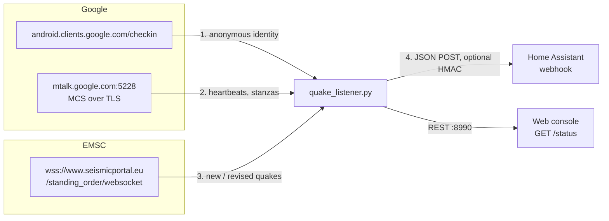

# How Quake MCS Listener works

This is a walkthrough of what `quake_listener.py` actually does on the wire, what has been verified, and what has not. It is written for people who want to audit the code, extend it, or try to prove the Google path works.

**Short version:**

- The bridge follows two push sources and turns events near your base station into a Home Assistant webhook.
- **Source 1, Google MCS (experimental).** It speaks Google's push protocol directly and can decode the protobuf format used by Android Earthquake Alerts (AEAS). In practice Google does not appear to send AEAS alerts to a client like this one (see [Why the Google path is a long shot](#why-the-google-path-is-a-long-shot)).
- **Source 2, EMSC (works).** It follows the European-Mediterranean Seismological Centre's public real-time WebSocket. Events arrive worldwide, a few minutes after they happen. That makes them fast reports, not early warnings.



---

## 1. Getting an identity: checkin

Before anything can log in to MCS, it needs an `android_id` and a `security_token`. The bridge gets them the same way Chrome's built-in GCM client does.

- **Request:** a protobuf `POST` to `https://android.clients.google.com/checkin`.
- **What it claims to be:** a Chrome build (`chrome_build { platform: 2, version: "120.0.6099.144", channel: 1 }`), with checkin `type: 3`. It also sends the locale (default `en_US`) and timezone (default `UTC`).
- **Response fields used:** field `7` is `android_id` and field `8` is `security_token`, both 64-bit integers.
- **Storage:** they are saved to `~/.quake_device_credentials.json` (or `--credentials-file`) with `0600` permissions and reused on later starts.

> [!IMPORTANT]
> This identity is a **browser-type GCM client**. It is not an Android phone, it has no Google Play services, it reports no location, and it is not registered (`register3`) with any sender or app. Keep that in mind for section 4.

## 2. Logging in to MCS

MCS (Mobile Connection Server) is the long-lived binary protocol behind Android and Chrome push.

**Connection.**
- TLS to `mtalk.google.com:5228`, with certificate verification on.
- The client sends one version byte (`41`), then the `LoginRequest`.

**Framing.** After the version byte, every message is `tag (1 byte) + length (varint) + protobuf payload`.

| Tag | Message | What the bridge does |
|---:|---|---|
| 0 | `HeartbeatPing` | Replies with a `HeartbeatAck` |
| 1 | `HeartbeatAck` | Measures the round-trip of its own ping |
| 2 | `LoginRequest` | Sent once per connection |
| 3 | `LoginResponse` | Checked for an error field; a rejection is reported as `Login rejected by MCS` |
| 4 | `Close` | Reconnects |
| 7 | `IqStanza` | Counted (the server uses these for acks) |
| 8 | `DataMessageStanza` | The only frame that can carry an alert |

**LoginRequest fields.** The login sends:
- `id`: `chrome-120.0.6099.144`
- `domain`: `mcs.android.com`
- `user` and `resource`: the `android_id`
- `auth_token`: the `security_token`
- `device_id`: `android-<hex android_id>`
- the `new_vc` setting
- `received_persistent_id` (repeated) for messages already handled, so Google does not resend them
- `adaptive_heartbeat`, `use_rmq2` and `auth_service`

**Reads.** Reads go through a buffer with a 0.5 s timeout. A frame split across TLS records is reassembled, not treated as an error. Frames over 4 MB and varints over 10 bytes are rejected as corrupt.

## 3. Staying connected

- **Heartbeats.** Every `--ping-interval` seconds (clamped to 30–600, default 120) the client sends a `HeartbeatPing` from the listener thread. `latency_ms` in `/status` is the real ping → ack round-trip. The TLS connect time is reported separately as `handshake_latency_ms`.
- **Dead links.** If nothing arrives for `ping_interval + 60` s, the connection is considered dead and reopened. TCP keepalive is also on.
- **Reconnects.** Backoff runs from 3 s to 60 s with jitter, and resets after a session that lasted at least 60 s.
- **Manual pings.** `POST /ping` only *asks* the listener thread to ping, so the HTTP thread never writes to the TLS socket.

## 4. Data messages and the AEAS decoder

When a `DataMessageStanza` (tag 8) arrives:

1. **De-duplication.** Its `persistent_id` (field 9) is checked against recently seen IDs, so re-deliveries are dropped.
2. **Category check.** If `category` (field 5) is `com.google.android.gms` and `raw_data` (field 21) is present, `raw_data` goes to the earthquake decoder.

**Decoder.** It walks this protobuf tree:

```
payload
└─ 2 (repeated) event
   ├─ 6 geometry
   │  └─ 2 zones
   │     └─ 1 (repeated) zone
   │        └─ 3 circle
   │           ├─ 1 center  { 1 lat (double), 2 lon (double) }
   │           └─ 2 radius_m
   ├─ 7 magnitude  { 2 value | 1 value }   (number or numeric string)
   └─ 8 region name (string)
```

**Where the schema comes from.** The variable names in the code (`jeim`, `jeik`, `jeif`, `jeig`, `jhom`) are obfuscated class names. That suggests the schema was taken from a decompiled Google Play services build.

**What has been tested.** The decoder has only been exercised with synthetic payloads (`--simulate`) and 500 rounds of random input. It has never seen a real alert.

**Turning an event into a payload.** For a decoded event the bridge:
- computes the haversine distance to the base station;
- picks a level: `alert` if the event is inside the impact radius (default 150 km) and M ≥ 4.5, or M ≥ 5.0 anywhere; otherwise `notice`;
- builds the payload described in [section 6](#6-what-reaches-home-assistant).

## Why the Google path is a long shot

Google's own descriptions say how AEAS alerts get to people:

- Alerts are delivered by **Google Play services**.
- Phones are chosen by their **coarse location**.
- The phone needs **Earthquake Alerts and location turned on**.

([Google Research blog](https://research.google/blog/android-earthquake-alerts-a-global-system-for-early-warning/); [Science, 2025](https://www.science.org/doi/10.1126/science.ads4779)).

In other words, Google decides on the server which enrolled phones are in the affected area, and pushes to those phones only. A browser-type identity that reports no location and has no app registrations is not in that set.

**What we measured.** The listener ran with `--debug-frames` for about four minutes on 2026-10-07:

```
Authenticated with mtalk.google.com:5228 (Handshake latency: 408.3 ms)
[frame] IqStanza 10B type=1 extension=12      ← a selective ack, nothing else
pings_sent 6 · pings_received 8 · messages_received 0 · latency_ms 91.2
```

The connection is healthy, but the only traffic is protocol housekeeping. Making Google send AEAS alerts would mean posing as a real, location-reporting Android device with Play services. We don't do that: it would mean misrepresenting the device to Google, and it would be fragile anyway.

If you have evidence that a client like this one receives AEAS stanzas, please [open an issue](https://github.com/Juanipis/quake-alert-listener/issues) with a `--debug-frames` log. That is exactly the kind of report this project needs.

## 5. The EMSC source

[EMSC's SeismicPortal](https://www.seismicportal.eu/realtime.html) pushes every new or revised earthquake worldwide. The data is licensed CC BY 4.0.

**Connection.** The bridge opens `wss://www.seismicportal.eu/standing_order/websocket` with a small built-in WebSocket client (still no dependencies):
- TLS, with the RFC 6455 handshake checked via `Sec-WebSocket-Accept`;
- masked client frames, fragmentation, ping/pong and close all handled;
- reconnection with the same backoff as MCS.

**Messages.** Each message looks like this:

```json
{"action": "create", "data": {"properties": {
  "unid": "…", "time": "…Z", "lat": 0.5, "lon": 0.5, "depth": 10.0,
  "mag": 4.6, "magtype": "mb", "flynn_region": "…", "auth": "…"}}}
```

**Filters.** An event fires the webhook only if all of these hold:

| Filter | Default | Why |
|---|---|---|
| Distance to base station | ≤ 300 km (`--emsc-radius-km`) | Only quakes you could feel |
| Magnitude | ≥ 4.0 (`--emsc-min-mag`) | Skip micro-quakes |
| Age of the event | ≤ 15 min | The feed also re-sends revisions of quakes from weeks ago |
| Already reported | Re-report only if magnitude rises by ≥ 0.5 | Revisions arrive several times per event |

**Level.** M ≥ 4.5 is `alert`; anything lower that passes the filters is `notice`.

**Logging.** Events within the radius, or of M ≥ 5.0 anywhere, are logged even when they don't pass the filters, so you can watch the feed in the web console.

**What we measured.** In a 2.5-minute sample on 2026-10-07, six real events arrived, between about 6 and 8 minutes after their origin times. That is too late for early warning, but useful to log the event, notify your phone, or check on the house afterwards.

Disable it with `--no-emsc` (or `QUAKE_NO_EMSC=1`).

## 6. What reaches Home Assistant

Both sources produce the same core JSON. They differ in `source`, in `status`, and in a few extra fields:

| Field | AEAS (MCS) | EMSC |
|---|---|---|
| `source` | `Android AEAS (MCS)` | `EMSC SeismicPortal` |
| `status` | `early alert` | `rapid report` |
| `level` / `nivel` | `alert` · `notice` (`alerta` · `aviso`) | same |
| `magnitude`, `lat`, `lon`, `distance_km`, `place`, `timestamp` | ✓ | ✓ |
| `radius_km` | from the alert | — |
| `depth_km`, `region`, `event_time`, `report_delay_s`, `url` | — | ✓ |

**Signing.** With `--webhook-secret`, the body is signed with HMAC-SHA256. The signature is sent in both `X-Quake-Signature` and `X-Sismo-Firma`.

**Delivery.** Webhooks run in a background thread, with three attempts on network errors or 5xx responses. `POST /drill` sends a `level: "drill"` payload synchronously, so you can test automations end to end.

## 7. The local REST API and its security model

| Endpoint | Method | Purpose |
|---|---|---|
| `/status` (also `/`, `/api/status`) | GET | Telemetry for both sources, last quake, recent logs |
| `/ping` | GET or POST | Ping MCS through the listener thread; returns `latency_ms` |
| `/drill` (also `/simulacro`) | POST | Send a drill payload to your webhook |

The API defends itself on three levels:

- **Binding.** The server listens on `127.0.0.1` by default, or on `0.0.0.0` automatically inside a container. Use `--http-host 0.0.0.0` to reach it from another machine.
- **Browser origins.** Only the official page and `localhost` pages get CORS headers. Other origins get `403` on `/ping` and `/drill` (`--allowed-origins`). Clients that send no `Origin` header, such as curl or Home Assistant, are not affected.
- **DNS rebinding.** Requests whose `Host` header is a foreign domain name are refused (`--allowed-hosts`). IPs, `localhost` and this machine's hostname always work.

## 8. Research it yourself

```bash
# Watch every non-heartbeat MCS frame (tag, size, category, sender, app_data keys)
python3 quake_listener.py --debug-frames --no-emsc

# Decode a synthetic AEAS payload and preview the webhook body (nothing is sent)
python3 quake_listener.py --simulate

# One-shot TLS + login + heartbeat round-trip
python3 quake_listener.py --test-ping
```
