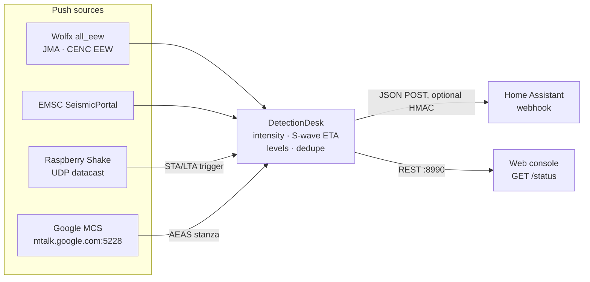

# How Quake MCS Listener works

This is a walkthrough of what `quake_listener.py` actually does on the wire, what has been verified, and what has not. It is written for people who want to audit the code, extend it, or try to prove the Google path works.

**Short version.** The bridge follows up to four push sources, works out what each quake means *at your base station*, and tells Home Assistant over a webhook.

| Source | Kind | Typical speed | Status |
| :--- | :--- | :--- | :--- |
| Official EEW via Wolfx (JMA, CENC, Sichuan, Fujian, Chongqing) | `eew` | seconds after origin | live |
| Raspberry Shake UDP datacast + STA/LTA | `onsite` | seconds, on site | tested with synthetic signals |
| EMSC SeismicPortal | `report` | minutes (measured ~6–8 min) | live |
| Google MCS + AEAS decoder | `aeas` | would be seconds | experimental; never observed delivering ([why](#why-the-google-path-is-a-long-shot)) |



Sections 1–4 cover the Google path in depth (it is the most involved protocol). Sections 5–7 cover the other sources and the desk that ties everything together.

---

## 1. Getting an identity: checkin

Before anything can log in to MCS, it needs an `android_id` and a `security_token`. The bridge gets them exactly the way Chrome's built-in GCM client does.

**Reference.** The implementation was checked field by field against Chromium's open-source client:
- [`checkin.proto` / `android_checkin.proto`](https://source.chromium.org/chromium/chromium/src/+/main:google_apis/gcm/protocol/)
- [`checkin_request.cc`](https://source.chromium.org/chromium/chromium/src/+/main:google_apis/gcm/engine/checkin_request.cc)

**Request.** A protobuf `POST` to `https://android.clients.google.com/checkin` containing:

| Field | Value | Notes |
|---|---|---|
| `2` id | `0` on first checkin, then the stored `android_id` | |
| `3` digest | the settings digest from the last response | |
| `4` checkin | `{ 12 type: DEVICE_CHROME_BROWSER (3), 13 chrome_build { platform, "120.0.6099.144", STABLE } }` | |
| `13` security_token | `0`, then the stored token | `fixed64` |
| `14` version | `3` | |
| `22` user_serial_number | `0` | |

No locale, timezone or hardware identifiers are sent; Chrome doesn't send them either.

> [!NOTE]
> Versions up to 2.0 put the device type and Chrome build in fields 1 and 2 of the checkin block instead of 12 and 13. Google then registered a default *Android OS* device with no build info.
>
> 2.1 sends the correct layout. A credentials file from an older version is re-checked in once on start, keeping the same `android_id`; this was verified live.

**Response.**
- `android_id` (field 7) and `security_token` (field 8) are `fixed64`.
- `time_ms` (field 3) is the server clock, used for the [clock check](#clock-check).
- `digest` (field 4) and `setting` (field 5) are Google's settings. Of these, only `checkin_interval` is used.

**Periodic checkin.** Like Chrome, the bridge checks in again every `checkin_interval`: 2 days by default, never less than 12 hours. This keeps the identity alive.

**Storage.** The identity is saved to `~/.quake_device_credentials.json` (or `--credentials-file`) with mode `0600`, together with the last checkin time, interval and digest.

> [!IMPORTANT]
> This identity is a **browser-type GCM client**. It is not an Android phone and has no Google Play services. It reports no location and is not registered (`register3`) with any sender or app; `/status` shows `"registrations": 0`. Keep that in mind for section 4.

## 2. Logging in to MCS

MCS (Mobile Connection Server) is the long-lived binary protocol behind Android and Chrome push. The bridge follows Chromium's [`mcs.proto`](https://source.chromium.org/chromium/chromium/src/+/main:google_apis/gcm/protocol/mcs.proto) and [`mcs_client.cc`](https://source.chromium.org/chromium/chromium/src/+/main:google_apis/gcm/engine/mcs_client.cc).

**Connection.**
- TLS to `mtalk.google.com:5228`, with certificate verification on. If port 5228 is blocked (some corporate or hotel networks), the client falls back to **port 443**, as Chrome does, and sticks with the port that worked (verified live).
- The client sends one version byte (`41`), then the `LoginRequest`.

**Framing.** After the version byte, every message is `tag (1 byte) + length (varint) + protobuf payload`.

| Tag | Message | What the bridge does |
|---:|---|---|
| 0 | `HeartbeatPing` | Replies with a `HeartbeatAck` carrying `last_stream_id_received` |
| 1 | `HeartbeatAck` | Measures the round-trip of its own ping |
| 2 | `LoginRequest` | Sent once per connection |
| 3 | `LoginResponse` | Error checked; heartbeat config and server time read |
| 4 | `Close` | Reconnects |
| 7 | `IqStanza` | `SelectiveAck` (12) and `StreamAck` (13) handled |
| 8 | `DataMessageStanza` | The only frame that can carry an alert; also carries the server's `IdleNotification` |

**LoginRequest fields.** The login is the same as Chrome's `BuildLoginRequest`:
- `id`: `chrome-120.0.6099.144`
- `domain`: `mcs.android.com`
- `user` and `resource`: the `android_id`
- `auth_token`: the `security_token`
- `device_id`: `android-<hex android_id>`
- `adaptive_heartbeat`: false
- `use_rmq2`: true
- `auth_service`: `ANDROID_ID`
- `network_type`: 1
- settings: `new_vc=1`, plus `hbping=<interval ms>` to announce our heartbeat interval, which Chrome sends for custom intervals
- `received_persistent_id`: every message id the server hasn't confirmed yet (see section 3)

**LoginResponse.**
- An error code other than 0 raises `MCSLoginRejected`. The bridge then re-checks in the identity once; if the next login also fails, it registers a fresh identity.
- `heartbeat_config.interval_ms` is honoured when it is *shorter* than ours. The bridge never pings less often than configured, because noticing a dead link fast matters here.
- `server_timestamp` feeds the clock check.

**Reads.** Reads go through a buffer with a 0.5 s timeout. A frame split across TLS records is reassembled, not treated as an error. Frames over 4 MB and varints over 10 bytes are rejected as corrupt.

## 3. Staying connected

**Heartbeats.**
- Every `--ping-interval` seconds (clamped to 30–600, default 120) the client sends a `HeartbeatPing` from the listener thread.
- `latency_ms` in `/status` is the real ping → ack round-trip. The TLS connect time is reported separately as `handshake_latency_ms`.

**Heartbeat timeout.** As in Chrome, any packet counts as an ack. If nothing arrives within 60 s of a ping, the link is considered dead and reopened. TCP keepalive is also on, and a session with no traffic at all for `ping_interval + 60` s is also reset.

**Acknowledgements (stream ids).** Each side counts the packets it has received; the `LoginResponse` is stream id 1.
- Every packet the bridge sends carries `last_stream_id_received`, which tells the server what has arrived.
- The bridge sends an explicit `StreamAck` (an `IqStanza` with extension 13) after every 10 unacknowledged messages, or at once when a message asks for `immediate_ack`.
- A message id counts as confirmed once the server echoes a `last_stream_id_received` that covers it. Ids not yet confirmed go into the next `LoginRequest`.
- This is what stops Google from re-delivering the same message after a reconnect.

**Idle notifications.** The server can send a `DataMessageStanza` in category `com.google.android.gsf.gtalkservice` with `IdleNotification`. The bridge answers `false`, as Chrome does, so it is not treated as an idle client.

**Reconnects.** Backoff runs from 3 s to 60 s with jitter, and resets after a session that lasted at least 60 s.

**Manual pings.** `POST /ping` only *asks* the listener thread to ping, so the HTTP thread never writes to the TLS socket.

### Clock check

Both the checkin response and the `LoginResponse` carry Google's clock. The bridge measures the offset against the midpoint of each request, which is accurate to about half a network round-trip, and publishes it as `clock.offset_s` in `/status`.

S-wave countdowns depend on the local clock, so an offset of 2 s or more is logged, and `now` is corrected by it when computing countdowns. If you see this warning, enable NTP on the machine.

## 4. Data messages and the AEAS decoder

When a `DataMessageStanza` (tag 8) arrives:

1. **De-duplication.** Its `persistent_id` (field 9) is checked against recently seen IDs, so re-deliveries are dropped.
2. **Category check.** If `category` (field 5) is `com.google.android.gms` and `raw_data` (field 21) is present, `raw_data` goes to the earthquake decoder.

**Decoder.** It walks this protobuf tree:

```
payload
└─ 2 (repeated) event
   ├─ 6 geometry
   │  └─ 2 zones
   │     └─ 1 (repeated) zone
   │        └─ 3 circle
   │           ├─ 1 center  { 1 lat (double), 2 lon (double) }
   │           └─ 2 radius_m
   ├─ 7 magnitude  { 2 value | 1 value }   (number or numeric string)
   └─ 8 region name (string)
```

**Where the schema comes from.** The variable names in the code (`jeim`, `jeik`, `jeif`, `jeig`, `jhom`) are obfuscated class names. That suggests the schema was taken from a decompiled Google Play services build.

**What has been tested.** The decoder has only been exercised with synthetic payloads (`--simulate`) and 500 rounds of random input. It has never seen a real alert.

**Origin time and alert ID.** Field `1` of each event carries an alert ID (sub-field `3`) and an origin time in milliseconds (sub-field `4`). They are used for deduplication and for the S-wave countdown.

**Hand-off.** A decoded event goes to the [detection desk](#6-the-detection-desk), like every other source. If Google's own impact circle covers your base station and M ≥ 4.5, the event is at least a `notice`, even if the intensity estimate is low. If an alert ever arrives without coordinates, the desk falls back to magnitude alone: M ≥ 5 is an `alert`, M ≥ 4 a `notice`.

### Device Profiles (Chrome vs Android)

The bridge supports two checkin device profiles via `--device-type {android,chrome}`:

1. **Android Profile (`--device-type android`, default):**
   - Emulates an authentic Google Pixel 6 (`google/oriole/oriole:14/UP1A.231005.007/10754064:user/release-keys`, GMS `240913000`, Android 14 SDK 34).
   - Checkin request sends `DEVICE_ANDROID_OS` (1) with complete `AndroidBuildProto`, SIM/operator codes (`732101`), locale (`es_CO`) and timezone (`America/Bogota`).
   - Login packet authenticates as `android-34`.
2. **Chrome Profile (`--device-type chrome`):**
   - Emulates Chromium's desktop GCM client with `DEVICE_CHROME_BROWSER` (3) and `chrome-120.0.6099.144`.

> [!NOTE]
> Google accepts both profiles with HTTP 200, assigning authentic `android_id` and `security_token`. Both profiles authenticate cleanly on `mtalk.google.com:5228` with ~80–120 ms round-trip latency.

### 4. Reverse-Engineering Google AEAS & Cloud Geofencing

### DEX Analysis of Google Play Services (`com.google.android.gms`)
By decompiling the DEX bytecode (`classes13.dex` and `classes15.dex`) of Google Play Services (`com.google.android.gms`), the internal AEAS pipeline was mapped end-to-end:

```
[mtalk.google.com:5228]
       │
       ▼ (MCS DataMessageStanza, tag 8, cat: com.google.android.gms)
[GcmReceiverChimeraService]
       │
       ▼ (Decodes Protobuf Payload)
[EAlertUxArgs] ────────► { magnitude, epicenter[lat/lng], distanceToEpicenterKm, arwRegionName }
       │
       ▼ (High-priority Intent START)
[EAlertSafetyInfoActivity] ──► Fullscreen Take Action Siren & Warning UI
```

1. **Inbound GCM Handler:** `com.google.android.location.quake.ealert.GcmReceiverChimeraService` processes incoming push stanzas from MCS.
2. **Alert Model:** Decoded into `com.google.android.location.quake.ealert.ux.EAlertUxArgs`, matching the protobuf schema implemented in `decode_earthquake_payload()`.
3. **Emergency UI Dispatch:** Automatically launches `com.google.android.location.settings.EAlertSafetyInfoActivity` with flags `FLAG_ACTIVITY_NEW_TASK | FLAG_ACTIVITY_NO_USER_ACTION`, bypassing Do Not Disturb and displaying the estimated arrival time of the S-wave.
4. **The Root Cause of 0 Data Messages on Pure Sockets:**
   Google AEAS is **not a global broadcast channel**. Google's cloud server only sends alert stanzas to devices that actively report location through Google's Fused Location Provider (`loc/m/api`) and Phenotype location beacons (`Ealert__location_interval_millis`).
   A standalone TCP client on `mtalk.google.com:5228` (whether Chrome or Android identity) does not transmit periodic Fused Location telemetry to Google's location reporting backend. Consequently, Google's server never matches a bare socket to any geographic earthquake polygon.

### The Production Solution: Autonomous Micro-Android Sentinel (Redroid)
To eliminate any dependence on a physical smartphone or a heavy desktop emulator running on a Mac/PC, the project supports running an **autonomous containerized Android 11 node (Redroid)** directly on the home server or Raspberry Pi 4:

- **Image & Environment:** `redroid/redroid:11.0.0_gapps` running containerized on Linux with BinderFS (`/dev/binderfs`) and Kernel PSI (`psi=1`).
- **Debloated Runtime:** UI launcher (`Launcher3`), Play Store (`vending`), and live wallpapers are disabled, stabilizing idle CPU usage at **~1.7%** on a Raspberry Pi 4.
- **Location Anchor:** A persistent mock location foreground service (`com.lexa.fakegps`) injects exact base station coordinates into both `gps` and `network` providers, keeping Google Play Services perpetually geolocated at your home.
- **Real-Time Sentinel Listener (`android_alert_listener.py`):**
  - Streams Android kernel logcat events in real time via `docker exec redroid-quake logcat -v time -b main -b events -b system -T 1 -e "EAlert|sismo|earthquake|..."`.
  - Achieves **<10 ms latency** and 0.0% CPU overhead at idle.
  - **Zero-False-Alarm Protection:** Ignores lifecycle exit events (`onDestroy`, `onPause`, `finish`), ignores configuration demos (`isTestAlert=true`, `EAlertSettings`), and verifies with `dumpsys activity top` before dispatching. If the screen is not active, events are discarded safely without triggering false alarms.
  - Signs payloads with HMAC-SHA256 (`X-Quake-Signature`) and posts to `:8990/android`.

See [docs/REDROID_SENTINEL.md](REDROID_SENTINEL.md) for the complete step-by-step setup guide.

---

### 5. Multilayer Redundancy: Official Geological Feeds (SGC & USGS)

In addition to Google AEAS, production deployments can run a multilayer polling strategy for official scientific agencies:

1. **SGC (Servicio Geológico Colombiano):**
   - Polling endpoint: `https://archive.sgc.gov.co/feed/v1.0.1/summary/five_days_all.json` every 15 seconds.
   - User-Agent header customized to pass CloudFront edge filters.
2. **USGS (United States Geological Survey):**
   - Polling endpoint: `https://earthquake.usgs.gov/earthquakes/feed/v1.0/summary/2.5_day.geojson` every 60 seconds.
3. **Zero-Bandwidth Conditional Caching:**
   - All requests send `If-None-Match: <ETag>` and `If-Modified-Since: <Last-Modified>`.
   - Returns **HTTP 304 Not Modified** (0 payload bytes) when no new events have occurred, consuming near-zero network bandwidth and host CPU.
4. **Intensity Engine (Atkinson, Worden & Wald 2014):**
   - For every reported hypocenter, local ground shaking at the base station is computed:
     $$\text{MMI} = 0.309 + 1.864 \cdot M - 1.672 \cdot \log_{10}(R) - 0.00219 \cdot R + 1.77 \cdot B - 0.383 \cdot M \cdot \log_{10}(R)$$
   - Events are automatically categorized as `notice` (MMI ≥ 2.5) or `alert` (MMI ≥ 3.5).
5. **Unified Incident Fusion:**
   - If Google AEAS fires first, the alarm sounds immediately.
   - When SGC/USGS subsequently publishes the reviewed seismic solution (with official magnitude, depth, and epicentral coordinates), the system links the event IDs and updates Home Assistant without re-triggering duplicate nuisance alarms.

---

### 5a. EMSC (worldwide rapid reports)

[EMSC's SeismicPortal](https://www.seismicportal.eu/realtime.html) pushes every new or revised earthquake worldwide. The data is licensed CC BY 4.0.

**Connection.** The bridge opens `wss://www.seismicportal.eu/standing_order/websocket` with a small built-in WebSocket client (still no dependencies):
- TLS, with the RFC 6455 handshake checked via `Sec-WebSocket-Accept`;
- masked client frames, fragmentation, ping/pong and close all handled;
- reconnection with the same backoff as MCS.

**Messages.** Each message looks like this:

```json
{"action": "create", "data": {"properties": {
  "unid": "…", "time": "…Z", "lat": 0.5, "lon": 0.5, "depth": 10.0,
  "mag": 4.6, "magtype": "mb", "flynn_region": "…", "auth": "…"}}}
```

**What happens to each event.** It goes to the [detection desk](#6-the-detection-desk). The feed also re-sends revisions of quakes from weeks ago, which the desk's 15-minute age limit drops.

**Logging.** EMSC events are logged when their estimated intensity at your base station is at least MMI 2, or when they are M ≥ 5 anywhere. That lets you watch the feed in the web console without flooding it with global micro-quakes.

**What we measured.** In a 2.5-minute sample on 2026-10-07, six real events arrived, between about 6 and 8 minutes after their origin times. That is too late for early warning, but useful to log the event, notify your phone, or check on the house afterwards.

Disable it with `--no-emsc` or `--sources mcs,wolfx`.

### 5b. Official early warnings via Wolfx (Japan, mainland China)

[Wolfx](https://wolfx.jp) is an independent public-interest project. It relays official earthquake early warnings as JSON over WebSocket.

**Connection.** The bridge subscribes to `wss://ws-api.wolfx.jp/all_eew`. It gets a `{"type": "heartbeat"}` every 60 s, plus every EEW as it is issued:

| `type` | Agency | Time zone of `OriginTime` |
|---|---|---|
| `jma_eew` | Japan Meteorological Agency | UTC+9, `YYYY/MM/DD HH:MM:SS` |
| `cenc_eew` | China Earthquake Networks Center | UTC+8, `YYYY-MM-DD HH:MM:SS` |
| `sc_eew`, `fj_eew`, `cq_eew` | Sichuan, Fujian, Chongqing networks | UTC+8 |

**Fields used:**
- `EventID`, plus `Serial` or `ReportNum` (the revision number);
- `Latitude`, `Longitude`, `Depth`;
- `Magnitude` (the misspelled `Magunitude` is also accepted);
- `Hypocenter` or `HypoCenter` (region name);
- `MaxIntensity` (the agency's own scale, passed through as `agency_intensity`);
- `isFinal`, `isCancel`, `isTraining`.

**Behaviour.** An EEW is issued seconds after the quake starts and revised several times as more stations report. The desk notifies on the first revision that reaches your threshold, and again only if a later revision makes it worse. Training messages are ignored, and a cancellation of something you were told about is passed on as `level: "cancel"`.

### 5c. On-site detection with a Raspberry Shake

Where no agency publishes EEW, the only true early warning is detecting the P-wave yourself.

**Input.** A [Raspberry Shake](https://raspberryshake.org) can be configured to send its *UDP datacast* to the machine running the bridge. Each packet is plain text: `{'EHZ', <epoch seconds>, <count>, <count>, …}`. Start the bridge with `--shake-udp 8888`.

**Detection.**
- The bridge watches the first vertical channel (`EHZ`, `ENZ`, …) or the one set with `--shake-channel`.
- It runs a recursive STA/LTA ([Withers et al., 1998](https://doi.org/10.1785/BSSA0880010095)) over the squared, de-meaned signal: 1 s short window, 30 s long window, 30 s warm-up.
- A trigger starts when the ratio reaches `--shake-sta-lta-on` (default 4.0) and ends below `--shake-sta-lta-off` (1.5).
- After a trigger, the next one is suppressed for 30 s.
- The bridge waits up to 3 s to measure the peak amplitude, then reports it.

**Level.** A trigger is a `notice`. It becomes an `alert` only if its peak reaches `--shake-alert-counts`, which you should calibrate for your floor.

**Limits.** A trigger cannot tell a quake from a slammed door, and the bridge has no magnitude for it. What it gives you is "something is shaking the house *now*", a few seconds before the strong part. The trigger is unit-tested with synthetic signals; it has not yet been tuned on a real installation.

## 6. The detection desk

All four sources produce the same *event* shape:
- `source`, `kind`, `event_id`, `revision`;
- `origin_ts`, `lat`, `lon`, `depth_km`;
- `magnitude`, `region`;
- `final`, `cancelled`, `training`.

`DetectionDesk.submit()` applies one policy to all of them.

**1. Local impact.**
- **Distances.** It computes the epicentral distance with the haversine formula, and the hypocentral distance with depth (10 km if unknown).
- **Intensity.** It estimates the median intensity at your base station with **Allen, Wald & Worden (2012)**, *Intensity attenuation for active crustal regions*. This is the hypocentral form and the default intensity prediction equation in USGS ShakeMap:

  ```
  MMI = 2.085 + 1.428·M − 1.402·ln √(R² + Rm²)  [+ 0.078·ln(R/50) if R > 50 km]
  Rm  = −0.209 + 2.042·e^(M−5)
  ```

  Sanity checks: M6 at 14 km ≈ MMI 6.9, M5 at 50 km ≈ 3.7, M7 at 100 km ≈ 5.7. The estimate ignores local soil, so expect about ±1 MMI.
- **Wave arrivals.** P-wave arrival is `origin + R / 6.0 km/s` and S-wave arrival is `origin + R / 3.5 km/s`. `s_wave_eta_s` is the time left until the S-wave when the payload is built.

**2. Filters.** An event is dropped when:
- it is a training message;
- it is older than 15 minutes;
- it is below `--min-magnitude`;
- it is farther than `--max-distance-km`.

**3. Level.**
- `alert` if the estimated MMI is at least `--alert-mmi` (5.0, like Android's "Take Action");
- `notice` if it is at least `--notice-mmi` (3.0, like Android's "Be Aware");
- otherwise nothing is sent.

**4. One quake, one story.** An event matches an already-notified quake if it has the same source and ID, or if it comes from another source with an origin within 90 s and an epicenter within 150 km. A match is announced again only when:
- the level goes up, or
- the estimated MMI rises by at least 1.

So an EEW, its revisions and the EMSC report a few minutes later produce one notification, plus an escalation if the quake turns out bigger. A cancelled EEW that had been announced produces a `cancel` payload.


## 7. What reaches Home Assistant

Every source produces the same JSON. These are the fields (synthetic values):

| Field | Example | Notes |
|---|---|---|
| `level` / `nivel` | `alert` / `alerta` | `notice`·`aviso`, `alert`·`alerta`, `cancel`·`cancelado`, `drill`·`simulacro` |
| `status` | `early warning` | `early warning` (EEW), `rapid report` (EMSC), `on-site trigger`, `early alert` (AEAS), `cancelled` |
| `source`, `kind` | `JMA EEW`, `eew` | `kind` is `eew` · `report` · `onsite` · `aeas` |
| `id`, `event_id`, `revision`, `final` | `eew-jma_eew:…`, `…`, `3`, `false` | Revision / final flags as given by the agency |
| `magnitude` / `magnitud`, `magnitude_type` | `6.1` | |
| `lat`, `lon`, `depth_km`, `region` | `0.5`, `0.5`, `30`, `Test Region` | |
| `distance_km` / `distancia_km`, `hypocentral_km` | `42.3`, `51.9` | From your `--lat/--lon` |
| `estimated_mmi`, `mmi_label` | `5.3`, `V · moderate` | Allen et al. (2012) at your base station |
| `agency_intensity` | `5-` | The agency's own scale (JMA shindo, CENC intensity) |
| `origin_time`, `report_delay_s` | ISO UTC, `4.8` | How late the information reached you |
| `p_wave_arrival_ts`, `s_wave_arrival_ts`, `s_wave_eta_s` | epoch, epoch, `9.8` | Countdown to strong shaking; `null` when unknown |
| `radius_km` | `90` | AEAS impact circle only |
| `place` / `lugar` | `M6.1 · Test Region · 42.3 km from Base Station · est. MMI V · S-wave in 9 s` | Ready to show or speak |
| `url`, `timestamp` / `hora_local` | | Event page (EMSC); local time the payload was built |

**Signing.** With `--webhook-secret`, the body is signed with HMAC-SHA256. The signature is sent in both `X-Quake-Signature` and `X-Sismo-Firma`.

**Delivery.** Webhooks run in a background thread, with three attempts on network errors or 5xx responses. `POST /drill` sends a `level: "drill"` payload synchronously, so you can test automations end to end.

## 8. The local REST API and its security model

| Endpoint | Method | Purpose |
|---|---|---|
| `/status` (also `/`, `/api/status`) | GET | Telemetry for every source (`google_mcs`, `sources.emsc/wolfx/shake`), thresholds, last quake, recent logs |
| `/ping` | GET or POST | Ping MCS through the listener thread; returns `latency_ms` |
| `/drill` (also `/simulacro`) | POST | Send a drill payload to your webhook |

The API defends itself on three levels:

- **Binding.** The server listens on `127.0.0.1` by default, or on `0.0.0.0` automatically inside a container. Use `--http-host 0.0.0.0` to reach it from another machine.
- **Browser origins.** Only the official page and `localhost` pages get CORS headers. Other origins get `403` on `/ping` and `/drill` (`--allowed-origins`). Clients that send no `Origin` header, such as curl or Home Assistant, are not affected.
- **DNS rebinding.** Requests whose `Host` header is a foreign domain name are refused (`--allowed-hosts`). IPs, `localhost` and this machine's hostname always work.

## 9. Research it yourself

```bash
# Watch every non-heartbeat MCS frame (tag, size, category, sender, app_data keys)
python3 quake_listener.py --debug-frames --no-emsc

# Decode a synthetic AEAS payload and preview the webhook body (nothing is sent)
python3 quake_listener.py --simulate

# Follow only the official early warnings and EMSC, with stricter thresholds
python3 quake_listener.py --sources wolfx,emsc --notice-mmi 3.5 --alert-mmi 5.5

# Run the offline test suite
python3 -m unittest discover -s tests -v

# One-shot TLS + login + heartbeat round-trip
python3 quake_listener.py --test-ping
```
