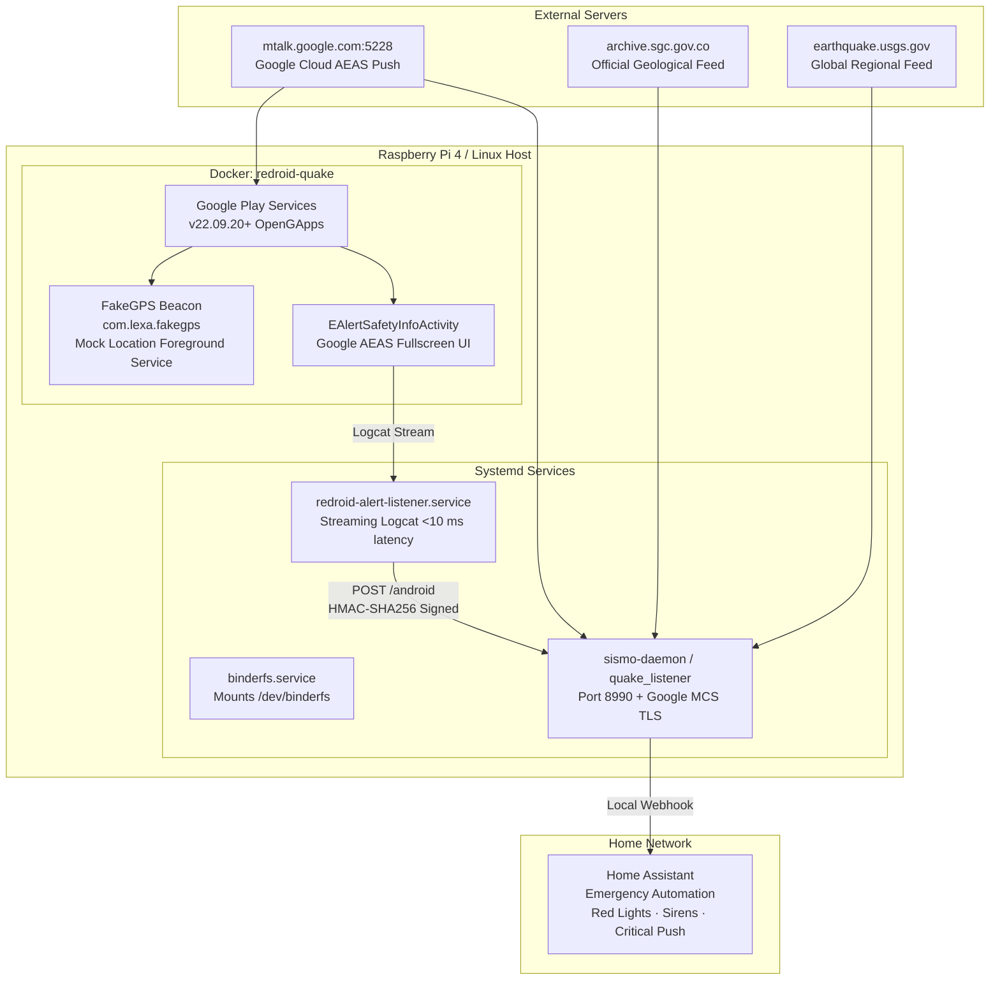

# 🤖 Autonomous Micro-Android Sentinel (Redroid on Raspberry Pi / Linux)

> **Run a 100% autonomous, headless Google Android Earthquake Alerts System (AEAS) node directly on your Linux home server or Raspberry Pi 4 without needing a physical phone or a computer running an emulator.**

---

## Architecture Overview



---

## 1. Linux Host & Kernel Prerequisites

Redroid requires two kernel features: **BinderFS** (Android IPC) and **PSI** (Pressure Stall Information).

### A. Enable PSI (Pressure Stall Information)
On Raspberry Pi OS (Debian/Ubuntu Linux):
1. Open `/boot/firmware/cmdline.txt` (or `/boot/cmdline.txt` on older kernels):
   ```bash
   sudo nano /boot/firmware/cmdline.txt
   ```
2. Append `psi=1` at the end of the single line (do not create a new line).
3. Reboot:
   ```bash
   sudo reboot
   ```
4. Verify PSI is active:
   ```bash
   cat /proc/pressure/memory
   # Should output: some avg10=0.00 avg60=0.00 ...
   ```

### B. Configure BinderFS
Instead of modifying `/etc/fstab`, create a dedicated systemd service to mount `/dev/binderfs` safely before Docker starts:

```bash
sudo tee /etc/systemd/system/binderfs.service > /dev/null << 'EOF'
[Unit]
Description=Mount BinderFS for Redroid
DefaultDependencies=no
Before=docker.service
ConditionVirtualization=false

[Service]
Type=oneshot
RemainAfterExit=yes
ExecStartPre=/bin/mkdir -p /dev/binderfs
ExecStart=/bin/mount -t binder binder /dev/binderfs
ExecStartPost=/bin/chmod -R 666 /dev/binderfs

[Install]
WantedBy=multi-user.target
EOF

sudo systemctl daemon-reload
sudo systemctl enable --now binderfs.service
```

Verify binder devices exist:
```bash
ls -la /dev/binderfs/
# Should list: binder, hwbinder, vndbinder
```

---

## 2. Deploy Containerized Redroid with OpenGApps

### A. Pull or Build Image
Use `redroid/redroid:11.0.0_gapps` (Android 11 with OpenGApps Pico ARM64):
```bash
docker pull redroid/redroid:11.0.0_gapps
```

### B. Persistent Directory & Launch
Run the container binding ADB **strictly to localhost** (`127.0.0.1:5555`) to keep your LAN completely secure:

```bash
# Create persistent data directory
mkdir -p /home/juanipis/redroid-data

# Launch container
docker run -d \
  --name redroid-quake \
  --restart always \
  --privileged \
  -v /dev/binderfs:/dev/binderfs \
  -v /home/juanipis/redroid-data:/data \
  -p 127.0.0.1:5555:5555 \
  redroid/redroid:11.0.0_gapps \
  androidboot.hardware=mt6885 \
  ro.secure=0 \
  ro.boot.hwc=NONE \
  ro.boot.container=1
```

---

## 3. Debloating for Ultra-Low Resource Usage

By default, an unthrottled Android container runs launcher animations, Play Store sync, and live wallpapers, consuming >300% CPU. Run the following once to stabilize idle CPU to **~1.7%**:

```bash
docker exec redroid-quake pm disable-user --user 0 com.android.launcher3
docker exec redroid-quake pm disable-user --user 0 com.android.wallpaper.livepicker
docker exec redroid-quake pm disable-user --user 0 com.android.vending
docker exec redroid-quake pm disable-user --user 0 com.google.android.apps.restore
docker exec redroid-quake pm disable-user --user 0 com.google.android.apps.pixelmigrate
```

---

## 4. Injecting Base Station Location Beacon

Google's cloud server routes early warnings based on the reporting location of the device. Install a mock GPS foreground service to anchor the node permanently to your base station coordinates:

```bash
# 1. Enable system location
docker exec redroid-quake cmd location set-location-enabled true
docker exec redroid-quake settings put secure location_mode 3

# 2. Install FakeGPS and grant mock location
docker exec redroid-quake pm install -r /path/to/fakegps.apk
docker exec redroid-quake appops set com.lexa.fakegps android:mock_location allow

# 3. Start persistent foreground location service (e.g. Bello, Antioquia: 6.3373, -75.5580)
docker exec redroid-quake am start-foreground-service -a com.lexa.fakegps.START -e lat 6.3373 -e long -75.5580
```

Verify in Android LocationManager:
```bash
docker exec redroid-quake dumpsys location | grep -E "last location="
# Output:
# last location=Location[network 6.337300, -75.557997 hAcc=3 m]
# last location=Location[gps 6.337297, -75.558003 hAcc=5 m]
```

---

## 5. Setting up `android_alert_listener.py` as a Systemd Service

Create `/etc/systemd/system/redroid-alert-listener.service`:

```ini
[Unit]
Description=Redroid Seismic Alert Sentinel (Google AEAS)
After=docker.service binderfs.service
Wants=docker.service

[Service]
Type=simple
User=juanipis
WorkingDirectory=/home/juanipis/projects/IoTCeiba606
Environment="DOCKER_CONTAINER=redroid-quake"
Environment="QUAKE_ALERT_URL=http://127.0.0.1:8990/android"
Environment="QUAKE_LAT=6.3373"
Environment="QUAKE_LON=-75.5580"
EnvironmentFile=/home/juanipis/projects/IoTCeiba606/.sismo.env
ExecStart=/usr/bin/python3 /home/juanipis/projects/IoTCeiba606/android_alert_listener.py
Restart=always
RestartSec=5

[Install]
WantedBy=multi-user.target
```

Enable and start the service:
```bash
sudo systemctl daemon-reload
sudo systemctl enable --now redroid-alert-listener.service
```

---

## 6. Zero False Alarm Protection

The sentinel listener includes multi-stage filtering to prevent false positives:
1. **Kernel Logcat Regex Filtering:** Streams directly from `docker exec redroid-quake logcat -v time -b main -b events -b system -T 1 -e ...`.
2. **Lifecycle Exit Filtering:** Explicitly ignores activity teardown logs (`onDestroy`, `onPause`, `onStop`, `finish`).
3. **Demo Isolation:** Detects `isTestAlert=true` and settings screens (`EAlertSettings`), preventing configuration menus from firing alarms.
4. **Active Top Activity Verification:** Only dispatches when `EAlertSafetyInfoActivity` is confirmed visible in `dumpsys activity top`. If the window is closing or absent, the event is safely discarded.
5. **HMAC-SHA256 Signing:** All outgoing HTTP requests carry cryptographic signatures verified by the central gateway.
