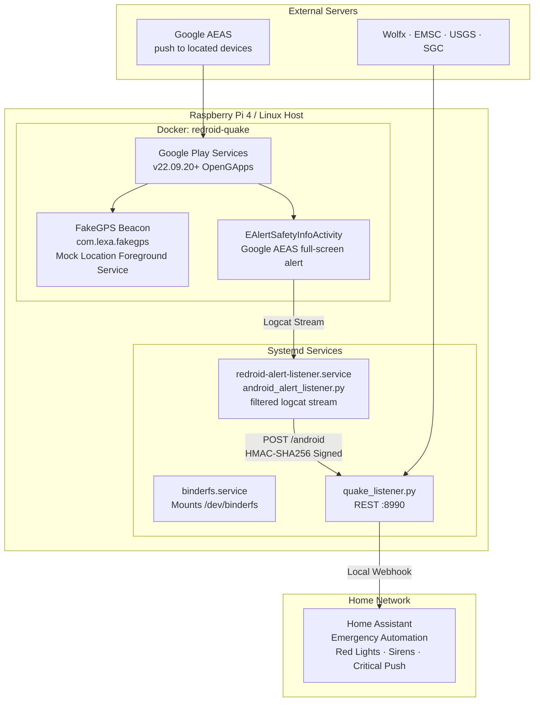

# 🤖 Android Sentinel (Redroid on Raspberry Pi / Linux)

> **Optional and experimental.** A headless Android container that keeps Google Play services located at your home, so it can receive Google's Android Earthquake Alerts (AEAS), and a small script that forwards them to the bridge. No physical phone, no desktop emulator.

> [!IMPORTANT]
> **Status (October 2026).** This setup has run 24/7 on a Raspberry Pi 4 in Colombia since 2026-10-07. Container, location beacon and log capture work, and Google's settings demo is detected and correctly ignored. **No real earthquake alert has been captured yet**, and it is still unproven that Google alerts a mock-located container. Treat it as an extra layer on top of the [sources that work today](HOW_IT_WORKS.md#5-sources-that-work-today), never as your only warning.

**Why it exists.** Google only sends AEAS alerts to devices that report their location, so the plain MCS socket in `quake_listener.py` never receives them ([details](HOW_IT_WORKS.md#why-the-google-path-is-a-long-shot)). A real Android system that reports a location is the only way in.

**What it costs.** An Android 11 system in a privileged container: about 2 % CPU on a Pi 4 once debloated (measured 1.7–1.9 %), plus the RAM and a few GB of storage Android needs. The bridge itself stays a single Python file.

---

## Architecture Overview



---

## 1. Linux Host & Kernel Prerequisites

Redroid requires two kernel features: **BinderFS** (Android IPC) and **PSI** (Pressure Stall Information).

### A. Enable PSI (Pressure Stall Information)
On Raspberry Pi OS (Debian/Ubuntu Linux):
1. Open `/boot/firmware/cmdline.txt` (or `/boot/cmdline.txt` on older kernels):
   ```bash
   sudo nano /boot/firmware/cmdline.txt
   ```
2. Append `psi=1` at the end of the single line (do not create a new line).
3. Reboot:
   ```bash
   sudo reboot
   ```
4. Verify PSI is active:
   ```bash
   cat /proc/pressure/memory
   # Should output: some avg10=0.00 avg60=0.00 ...
   ```

### B. Configure BinderFS
Instead of modifying `/etc/fstab`, create a dedicated systemd service to mount `/dev/binderfs` safely before Docker starts:

```bash
sudo tee /etc/systemd/system/binderfs.service > /dev/null << 'EOF'
[Unit]
Description=Mount BinderFS for Redroid
DefaultDependencies=no
Before=docker.service
ConditionVirtualization=false

[Service]
Type=oneshot
RemainAfterExit=yes
ExecStartPre=/bin/mkdir -p /dev/binderfs
ExecStart=/bin/mount -t binder binder /dev/binderfs
ExecStartPost=/bin/chmod -R 666 /dev/binderfs

[Install]
WantedBy=multi-user.target
EOF

sudo systemctl daemon-reload
sudo systemctl enable --now binderfs.service
```

Verify binder devices exist:
```bash
ls -la /dev/binderfs/
# Should list: binder, hwbinder, vndbinder
```

---

## 2. Deploy Containerized Redroid with OpenGApps

### A. Pull or Build Image
Use `redroid/redroid:11.0.0_gapps` (Android 11 with OpenGApps Pico ARM64):
```bash
docker pull redroid/redroid:11.0.0_gapps
```

### B. Persistent Directory & Launch
Run the container with ADB bound **only to localhost** (`127.0.0.1:5555`), so nothing else on your LAN can reach it:

```bash
# Create persistent data directory
mkdir -p ~/redroid-data

# Launch container
docker run -d \
  --name redroid-quake \
  --restart always \
  --privileged \
  -v /dev/binderfs:/dev/binderfs \
  -v ~/redroid-data:/data \
  -p 127.0.0.1:5555:5555 \
  redroid/redroid:11.0.0_gapps \
  androidboot.hardware=mt6885 \
  ro.secure=0 \
  ro.boot.hwc=NONE \
  ro.boot.container=1
```

> [!WARNING]
> Redroid needs `--privileged`, and `ro.secure=0` gives root inside Android. Run it only on a machine you control, keep ADB on `127.0.0.1`, and keep `/data` out of shared folders.

---

## 3. Debloating

Out of the box the container runs the launcher, Play Store sync and live wallpapers, which kept the Pi's CPU busy (over 300 % in our case). Disable them once; idle CPU then settles around 2 %:

```bash
docker exec redroid-quake pm disable-user --user 0 com.android.launcher3
docker exec redroid-quake pm disable-user --user 0 com.android.wallpaper.livepicker
docker exec redroid-quake pm disable-user --user 0 com.android.vending
docker exec redroid-quake pm disable-user --user 0 com.google.android.apps.restore
docker exec redroid-quake pm disable-user --user 0 com.google.android.apps.pixelmigrate
```

---

## 4. Injecting Base Station Location Beacon

Google decides who gets an alert from the location each device reports. Pin the container to your base station with a mock-location app. The listener drives the open-source **FakeGPS** app (`com.lexa.fakegps`) through its `START` intent; get its APK from a source you trust.

```bash
# Your base station (replace with your own coordinates)
LAT=<your-lat>; LON=<your-lon>

# 1. Enable system location
docker exec redroid-quake cmd location set-location-enabled true
docker exec redroid-quake settings put secure location_mode 3

# 2. Install FakeGPS and allow it to mock the location
docker cp fakegps.apk redroid-quake:/data/local/tmp/fakegps.apk
docker exec redroid-quake pm install -r /data/local/tmp/fakegps.apk
docker exec redroid-quake appops set com.lexa.fakegps android:mock_location allow

# 3. Start the foreground location service
docker exec redroid-quake am start-foreground-service -a com.lexa.fakegps.START -e lat "$LAT" -e long "$LON"
```

Check that Android reports your coordinates:
```bash
docker exec redroid-quake dumpsys location | grep -E "last location="
# last location=Location[gps <your-lat>, <your-lon> hAcc=5 m]
```

The listener re-applies this beacon every 10 minutes, so a restart of the app or the container heals by itself.

---

## 5. Setting up `android_alert_listener.py` as a Systemd Service

The listener talks to the container through `docker exec`, so its user must be in the `docker` group (which is root-equivalent on that machine). Put the shared secret in a file only that user can read:

```bash
# Same secret as the bridge's QUAKE_ANDROID_SECRET
sudo install -m 600 -o <user> /dev/null /etc/quake-android.env
echo "QUAKE_ANDROID_SECRET=$(openssl rand -hex 32)" | sudo tee /etc/quake-android.env > /dev/null
```

Create `/etc/systemd/system/redroid-alert-listener.service`:

```ini
[Unit]
Description=Android earthquake alert sentinel (Redroid -> Quake MCS Listener)
After=docker.service binderfs.service
Wants=docker.service

[Service]
Type=simple
User=<user>
Environment="DOCKER_CONTAINER=redroid-quake"
Environment="QUAKE_ALERT_URL=http://127.0.0.1:8990/android"
Environment="QUAKE_LAT=<your-lat>"
Environment="QUAKE_LON=<your-lon>"
EnvironmentFile=/etc/quake-android.env
ExecStart=/usr/bin/python3 /opt/quake-listener/android_alert_listener.py
Restart=always
RestartSec=5

[Install]
WantedBy=multi-user.target
```

Copy `android_alert_listener.py` to `/opt/quake-listener/` and give the bridge the same secret (`QUAKE_ANDROID_SECRET` in `/etc/default/quake-listener`, see `deploy/quake-listener.env`). Without one, the bridge accepts `/android` only from the same machine.

Enable and start the service:
```bash
sudo systemctl daemon-reload
sudo systemctl enable --now redroid-alert-listener.service
```

---

## 6. False-alarm guards

A red-lights automation must not fire because someone opened a settings screen. The listener:
1. **Filters logcat on the device side** (`logcat -v time -b main -b events -b system -T 1 -e "EAlert|earthquake|…"`), so it only wakes up for relevant lines.
2. **Ignores lifecycle lines** for activities that are closing (`onDestroy`, `onPause`, `onStop`, `finish`…).
3. **Ignores the settings screens and the demo** (`EAlertSettings…`, `isTestAlert=true`). Use `--include-demo` to test the whole chain with Google's demo on purpose.
4. **Confirms the alert is on screen**: it only forwards when `dumpsys activity top` shows `EAlertSafetyInfoActivity`; otherwise the line is discarded.
5. **Signs every request** with HMAC-SHA256 (`X-Quake-Signature`), which the bridge verifies.

## 7. Test it end to end

```bash
# Drill: the bridge forwards a level "drill" payload to your webhook
DOCKER_CONTAINER=redroid-quake QUAKE_ALERT_URL=http://127.0.0.1:8990/android \
  QUAKE_ANDROID_SECRET=... python3 android_alert_listener.py --drill

# One-shot inspection of what is on screen right now (nothing is sent without QUAKE_ALERT_URL)
DOCKER_CONTAINER=redroid-quake python3 android_alert_listener.py --once
```

If you capture a real alert, please [open an issue](https://github.com/Juanipis/quake-alert-listener/issues/new) with the (redacted) log lines: it would be the first confirmed capture.
